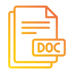

# OCS Docs Generator
<br />

  

[Big thanks to icon author](https://www.flaticon.com/premium-icon/doc_5730866?term=docs&page=2&position=23&page=2&position=23&related_id=5730866&origin=search)

Simple but powerful Nuget Package that allows you to generate JSON documentation for your C# code.

## Table of contents
* [Technologies](#technologies)
* [Usage](#usage)
* [Steps to follow](#steps-to-follow)
* [Updates](#updates)

## Technologies
* C#

## Usage
You have to download the Nuget package from nuget repo.

### Steps to follow:
### 1. Decorate methods

Add using directive:
```csharp
using DocGenerator.Attributes;
```

Decorate the methods (**only methods**) with Documentation attribute:
```csharp
[Documentation("Example")]
public void Example()
{

}
```

The value you pass to attribute constructor is the description of what this method does.

**Important**:
You can add as many Documentation attributes as you want, the construction presented below is possible:
```csharp
[Documentation("Example")]
[Documentation("Example2")]
[Documentation("Example3")]
public void Example2()
{

}
```

### 2. Instantiate DocumentationCreator.Creator

Add using directive:
```csharp
using DocGenerator.DocumentationCreator;
```

Somewhere in your program (for example in Program.cs) create the object as presented below:
```csharp
Creator cr = new Creator(typeof(Program),"First");
```
Where the first argument is the type of class you want to create documentation for (and for all using statements too) and the second is the namespace name fragment - important for performance reasons (behind the scenes there is reflection which is time and resource consuming).

## Updates
 * 1.0.0 First Relase
